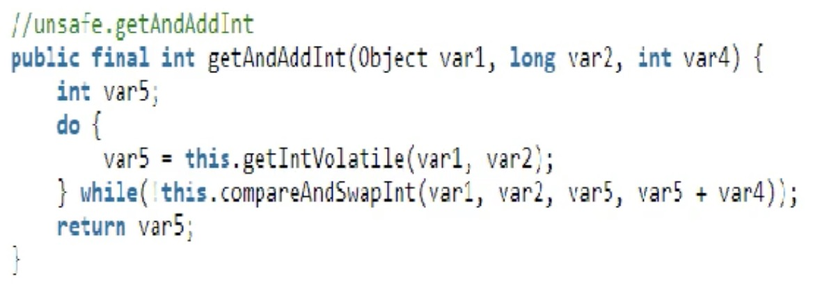

## java锁分类以及机制

#### 公平锁和非公平锁

> 公平锁类似于阻塞队列，所有线程都按照先后顺序排队获取锁

> 非公平锁是指多个线程获取锁的顺序并不是按照申请锁的顺序，有可能后申请的线程比先申请的线程优先获得锁，在高并发的情况下会造成优先级反转或者是饥饿现象

两者区别：

- 公平锁只有在当前锁维护的队列为空时或者处于队首时，才会占有锁，否则加入到队尾，按照FIFO(先进先出)的规则从队列中取到自己
- 非公平锁是直接尝试获取锁，如果尝试失败，再采用类似于公平锁的那种方式

ReentrantLock可以指定构造方法中的boolean值来指定公平或者非公平锁，不指定默认是非公平锁。

synchronized而言，也是一种非公平锁。

#### 可重入锁(递归锁)

> 可重入锁又名递归锁，是指同一线程外层函数在获得锁之后，内层递归函数仍能获取该锁的代码

> 也就是说，==线程可以进入任何一个它已经拥有的锁所同步着的代码块==

ReentrantLock/Synchronized就是典型的可重入锁

可重入锁最大的作用是避免死锁

代码实现：

```java
import java.util.concurrent.locks.Lock;
import java.util.concurrent.locks.ReentrantLock;

/**
 * 通过sendSMS()和sendEmail()可以看出synchronized是一个典型的可重入锁
 * 通过get()和set()可以看出ReentrantLock也是一个典型的可重入锁
 */
public class ReenterLockDemo implements Runnable {

    Lock lock = new ReentrantLock();

    public synchronized void sendSMS() {
        System.out.println(Thread.currentThread().getName() + "\t invoked sendSMS()");
        sendEmail();
    }

    public synchronized void sendEmail() {
        System.out.println(Thread.currentThread().getName() + "\t invoked sendEmail()");
    }

    public static void main(String[] args) {
        ReenterLockDemo reenterLockDemo = new ReenterLockDemo();
        new Thread(() -> {
            reenterLockDemo.sendSMS();
        }, "t1").start();
        new Thread(() -> {
            reenterLockDemo.sendSMS();
        }, "t2").start();
        new Thread(reenterLockDemo, "t3").start();
        new Thread(reenterLockDemo, "t4").start();
    }

    @Override
    public void run() {
        get();
    }

    public void get() {
        try {
            lock.lock();
            System.out.println(Thread.currentThread().getName() + "\t invoked get()");
            set();
        } finally {
            lock.unlock();
        }
    }

    public void set() {
        try {
            lock.lock();
            System.out.println(Thread.currentThread().getName() + "\t invoked set()");
        } finally {
            lock.unlock();
        }
    }
}
```

注意：==lock.lock()可以锁多次，但是lock.unlock()也必须调用相同次数，即加锁几次，解锁几次。==

#### 自旋锁

> 自旋锁是指尝试获取锁的线程不会阻塞，而是采用循环的方式去尝试获取锁

> 好处是减少线程上下文切换的消耗，缺点是循环会消耗CPU资源

CMS原理：



采用自旋的方式实现线程安全

代码实现：

```java
import java.util.concurrent.atomic.AtomicReference;

/**
 * 自旋锁代码实现
 * 自旋锁由于会不断的尝试获取锁，会耗费一定的cpu资源，所以谨慎使用
 */
public class SpinLockDemo {

    // 原子引用线程
    AtomicReference<Thread> atomicReference = new AtomicReference<>();

    public void myLock(){
        Thread thread = Thread.currentThread();
        System.out.println(Thread.currentThread().getName()+"\t come in");
        // 自旋等待
        while (!atomicReference.compareAndSet(null,thread)){

        }
    }

    public void myUnLock(){
        Thread thread = Thread.currentThread();
        System.out.println(Thread.currentThread().getName()+"\t invoked myUnLock()");
        // 释放锁
        atomicReference.compareAndSet(thread,null);
    }

    public static void main(String[] args) {
        SpinLockDemo spinLockDemo = new SpinLockDemo();

        new Thread(()->{
            spinLockDemo.myLock();
            try {
                Thread.sleep(5000);
            } catch (InterruptedException e) {
                e.printStackTrace();
            }
            spinLockDemo.myUnLock();
        },"AA").start();

        try {
            Thread.sleep(1000);
        } catch (InterruptedException e) {
            e.printStackTrace();
        }
        new Thread(()->{
            spinLockDemo.myLock();
            try {
                Thread.sleep(1000);
            } catch (InterruptedException e) {
                e.printStackTrace();
            }
            spinLockDemo.myUnLock();
        },"BB").start();
    }

}
```

#### 独占锁(写锁)/共享锁(读锁)/互斥锁

> 独占锁(写锁)：指该锁一次只能被一个线程持有，对ReentrantLock和Synchronized而言都是独占锁

> 共享锁(读锁)：指该锁可被多个线程所持有

> 对ReentrantReadWriteLock其读锁是共享锁，其写锁是独占锁

> 互斥：指读写、写读、写写的过程是互斥的，而读锁的共享锁可保证并发读是非常高效的

代码实现：

```java
import java.util.HashMap;
import java.util.Map;
import java.util.concurrent.locks.ReentrantReadWriteLock;

public class ReadWriteLockDemo {
    public static void main(String[] args) {
        MyCache myCache = new MyCache();
        for (int i = 0; i < 5; i++) {
            final int tempInt = i;
            new Thread(() -> {
                myCache.put(tempInt + "", tempInt + "");
            }, String.valueOf(i)).start();
        }
        for (int i = 0; i < 5; i++) {
            final int tempInt = i;
            new Thread(() -> {
                myCache.get(tempInt+"");
            }, String.valueOf(i)).start();
        }
    }
}


/**
 * 模拟缓存操作
 * 读-读能共存
 * 写-读不能共存
 * 写-写不能共存
 * 写操作：原子+独占
 */
class MyCache {
    public volatile Map<String, Object> map = new HashMap<>();
    // JUC下的读写锁
    private ReentrantReadWriteLock readWriteLock = new ReentrantReadWriteLock();

    public void put(String key, Object value) {
        try {
            // 使用读锁
            readWriteLock.writeLock().lock();
            System.out.println(Thread.currentThread().getName() + "\t 开始写入：" + key);
            Thread.sleep(300);
            map.put(key, value);
            System.out.println(Thread.currentThread().getName() + "\t 写入完成");
        } catch (Exception e) {
            e.printStackTrace();
        } finally {
            readWriteLock.writeLock().unlock();
        }
    }

    public void get(String key) {
        try {
            readWriteLock.readLock().lock();
            System.out.println(Thread.currentThread().getName() + "\t 开始读取");
            Thread.sleep(300);
            Object object = map.get(key);
            System.out.println(Thread.currentThread().getName() + "\t 读取完成：" + object);
        } catch (Exception e) {
            e.printStackTrace();
        } finally {
            readWriteLock.readLock().unlock();
        }
    }
}
```

