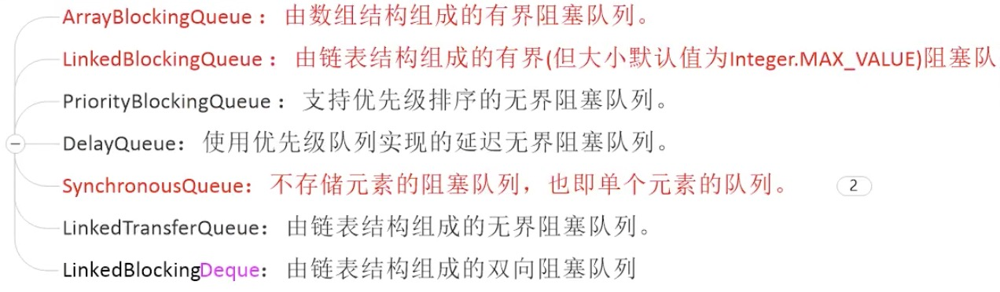
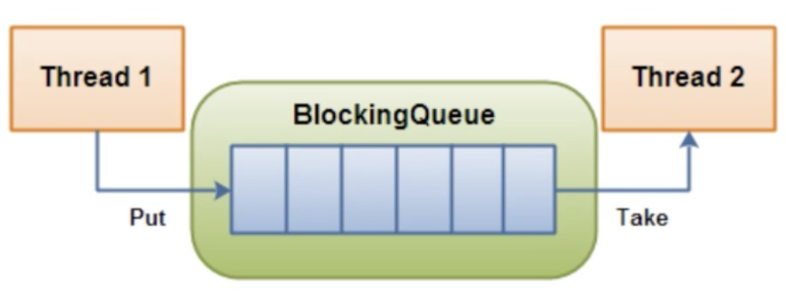

## 阻塞队列你知道吗？

### 阻塞队列有哪些

> 阻塞队列一共有以下7种：



- ArrayBlockingQueue：是一个基于数组结构的有界阻塞队列，此队列按 FIFO（先进先出）对元素进行排序。
- LinkedBlokcingQueue：是一个基于链表结构的阻塞队列，此队列按 FIFO（先进先出）对元素进行排序，吞吐量通常要高于 ArrayBlockingQueue。
- SynchronousQueue：是一个不存储元素的阻塞队列，每个插入操作必须等到另一个线程调用移除操作，否则插入操作一直处于阻塞状态，吞吐量通常要高于 LinkedBlokcingQueue。

### 什么是阻塞队列

> 阻塞队列，顾名思义，首先它是一个队列，而一个阻塞队列在数据结构中所起的作用大致如图所示：



- 当阻塞队列是空时，从队列中获取元素的操作将会被阻塞。
- 当阻塞队列是满时，往队列里添加元素的操作将会被阻塞。

###ArrayBlockingQueue

- 核心方法

  | 方法类型 | 抛异常 | 特殊值 | 阻塞 | 超时 |
  | :--: | :--: | :--: | :--: | :--: |
  | 插入 | add(o) | offer(o) | put(o) | offer(o, timeout, timeunit) |
  | 移除 | remove(o) | poll() | take() | poll(timeout, timeunit) |
  | 检查 | element() | peek() | 不可用 | 不可用 |

- 行为解释：

  - 抛异常：如果操作不能马上进行，则抛出异常
  - 特定的值：如果操作不能马上进行，将会返回一个特殊的值，一般是 true 或者 false，如果获取不到，会返回null。
  - 阻塞：如果操作不能马上进行，操作会被阻塞
  - 超时：如果操作不能马上进行，操作会被阻塞指定的时间，如果指定时间没执行，则返回一个特殊值，一般是 true 或者 false

- 插入方法：

  - add(E e)：添加成功返回true，失败抛 IllegalStateException 异常
  - offer(E e)：成功返回 true，如果此队列已满，则返回 false
  - put(E e)：将元素插入此队列的尾部，如果该队列已满，则一直阻塞

- 删除方法：

  - remove(Object o) ：移除指定元素,成功返回true，失败返回false
  - poll()：获取并移除此队列的头元素，若队列为空，则返回 null
  - take()：获取并移除此队列头元素，若没有元素则一直阻塞

- 检查方法：

  - element() ：获取但不移除此队列的头元素，没有元素则抛异常
  - peek() :获取但不移除此队列的头；若队列为空，则返回 null

```java
import java.util.concurrent.ArrayBlockingQueue;
import java.util.concurrent.BlockingQueue;

/**
 * 阻塞队列一共有7种
 * 但是常用的有三种:ArrayBlockingQueue、LinkedBlockingQueue、SynchronousBlockingQueue
 */
public class BlockingQueueDemo {

    public static void main(String[] args) throws Exception {
        BlockingQueue<String> queue= new ArrayBlockingQueue<>(3);// 容量为3的阻塞队列

        System.out.println(queue.add("a"));
        System.out.println(queue.add("b"));
        System.out.println(queue.add("c"));
//        System.out.println(queue.add("d"));   // 此时会抛出java.lang.IllegalStateException: Queue full异常

        System.out.println(queue.remove());
        System.out.println(queue.remove());
        System.out.println(queue.remove());
//        System.out.println(queue.remove());   // 此时会抛出java.util.NoSuchElementException异常

        System.out.println(queue.offer("a"));
        System.out.println(queue.offer("b"));
        System.out.println(queue.offer("c"));
        System.out.println(queue.offer("d"));   // 此时会返回false

        System.out.println(queue.poll());
        System.out.println(queue.poll());
        System.out.println(queue.poll());
        System.out.println(queue.poll());   // 此时会返回null

        queue.put("a");
        queue.put("b");
        queue.put("c");
//        queue.put("d");     // 此时线程会阻塞，直到有位置空出来为止

        System.out.println(queue.take());
        System.out.println(queue.take());
        System.out.println(queue.take());
//        System.out.println(queue.take());   // 此时线程会阻塞，直到能从队列取出值为止
    }
}
```

###SynchronousBlockingQueue

#### 传统生产者消费者模型

> 传统的生产者消费者模型，通过使用锁来操作线程的等待与唤醒，使用lock比synchronized更优

```java
import java.util.concurrent.locks.Condition;
import java.util.concurrent.locks.Lock;
import java.util.concurrent.locks.ReentrantLock;

/**
 * 题目：一个初始值为0的变量，两个线程对其进行交替操作，一个加1一个减1，来5轮
 *
 * 1. 线程    操作    资源类
 * 2. 判断    干活    通知
 * 3. 防止虚假唤醒机制
 */
public class ProdConsumer_TraditionalDemo {

    public static void main(String[] args) {
        ShareData data = new ShareData();
        new Thread(()->{
            for (int i = 0; i < 5; i++) {
                try {
                    data.increment();
                } catch (Exception e) {
                    e.printStackTrace();
                }
            }
        },"AA").start();

        new Thread(()->{
            for (int i = 0; i < 5; i++) {
                try {
                    data.decrement();
                } catch (Exception e) {
                    e.printStackTrace();
                }
            }
        },"BB").start();
    }
}

class ShareData{    // 资源类
    Integer number = 0;
    Lock lock = new ReentrantLock();
    Condition  condition = lock.newCondition();

    public void increment(){
        lock.lock();
        try {
            while (number!=0){
                // 等待，不能生产
                condition.await();
            }
            number++;
            System.out.println(Thread.currentThread().getName()+"\t"+number);
            // 通知唤醒
            condition.signalAll();
        } catch (InterruptedException e) {
            e.printStackTrace();
        } finally {
            lock.unlock();
        }

    }

    public void decrement(){
        lock.lock();
        try {
            while (number==0){
                // 等待，不能消费
                condition.await();
            }
            number--;
            System.out.println(Thread.currentThread().getName()+"\t"+number);
            // 通知唤醒
            condition.signalAll();
        } catch (InterruptedException e) {
            e.printStackTrace();
        } finally {
            lock.unlock();
        }

    }
}
```

API中特别提示：

```java
synchronized (obj) {
  while (<condition does not hold>)
    obj.wait(timeout);
  ... // Perform action appropriate to condition
}
```

**==特别注意：使用Object的wait()方法或者Lock.Condition的await()方法进行线程阻塞时，判断条件一定是一个loop(循环)，不能用if判断，因为可能会产生虚假唤醒，必须通过loop循环来判断是否符合条件。==**

#### 使用BlockingQueue实现的生产者消费者模型

> 通过使用阻塞队列来实现生产者消费者模型，不用手动操作线程的阻塞以及唤醒，而是通过阻塞队列实现。

```java
import java.util.concurrent.ArrayBlockingQueue;
import java.util.concurrent.BlockingQueue;
import java.util.concurrent.TimeUnit;
import java.util.concurrent.atomic.AtomicInteger;

/**
 * volatile/CAS/AtomicInteger/BlockingQueue/线程交互
 *
 * synchronousQueue是一个空阻塞队列，如果有线程向队列中插入元素，那么线程将会阻塞，直到有另外一个线程来取出元素
 */
public class ProdConsumer_BlockingQueueDemo {

    public static void main(String[] args) throws Exception {
        MyResource resource = new MyResource(new ArrayBlockingQueue<>(3));
        new Thread(() -> {
            System.out.println(Thread.currentThread().getName()+"\t 生产者线程启动");
            try {
                resource.myProd();
            } catch (Exception e) {
                e.printStackTrace();
            }
        }, "Prod").start();

        new Thread(()->{
            System.out.println(Thread.currentThread().getName()+"\t 消费者线程启动");
            try {
                resource.myConsumer();
            } catch (Exception e) {
                e.printStackTrace();
            }
        },"Consumer").start();

        TimeUnit.SECONDS.sleep(5);
        System.out.println();
        System.out.println();
        System.out.println();
        System.out.println(Thread.currentThread().getName()+"\t 停止生产消费");
        resource.stop();
    }
}

class MyResource {
    // 用于判断是否继续生产消费,因此需要volatile关键字让消费和生产线程都可见
    private volatile boolean FLAG = true;
    private AtomicInteger atomicInteger = new AtomicInteger();
    // 传接口不传具体实现类，拓展性高，低耦合
    private BlockingQueue<String> blockingQueue = null;

    public MyResource(BlockingQueue<String> blockingQueue) {
        this.blockingQueue = blockingQueue;
        System.out.println(blockingQueue.getClass().getName());
    }

    // 生产
    public void myProd() throws Exception {
        String data = null;
        boolean retValue;
        while (FLAG) {
            data = atomicInteger.incrementAndGet() + "";
            retValue = blockingQueue.offer(data, 2L, TimeUnit.SECONDS);
            if (retValue) {
                System.out.println(Thread.currentThread().getName() + "\t 插入队列" + data + "成功");
            } else {
                System.out.println(Thread.currentThread().getName() + "\t 插入队列" + data + "失败");
            }
            TimeUnit.SECONDS.sleep(1);
        }
        System.out.println("===========生产叫停==========");
    }

    // 消费
    public void myConsumer() throws Exception {
        String result = null;
        while (FLAG) {
            result = blockingQueue.poll(2, TimeUnit.SECONDS);
            if (result == null || result.equalsIgnoreCase("")) {
                FLAG = false;
                System.out.println(Thread.currentThread().getName() + "\t 超过2秒钟没有取到，消费退出");
                System.out.println();
                System.out.println();
                return;
            }
            System.out.println(Thread.currentThread().getName() + "\t 消费队列" + result + "成功");
        }
    }

    // 停止生产消费
    public void stop() {
        this.FLAG = false;
    }
}
```

### synchronized和Lock有什么区别？用新的lock有什么好处？

#### 原始构成

> synchronized是关键字属于JVM层面

monitorenter(底层是通过monitor对象来完成，其实wait/notify等方法也依赖于monitor对象，只有在同步块或方法中才能调用wait/notify等方法)

monitorexit

> Lock是具体类(java.util.concurrent.locks.Lock)是api层面的锁

#### 使用方法

>  synchronized 不需要用户去手动释放锁，当synchronized代码执行完后系统会自动让线程释放对锁的占用

> ReentrantLock则需要用具去手动释放锁，若没有主动释放锁，就有可能导致出现死锁现象。需要lock()和unlock()方法配合try/finally语句块来完成。

#### 等待是否可中断

> synchronized不可中断，除非抛出异常或者正常运行完成

> ReentrantLock 可中断
>
> 1.设置超时方法 tryLock(long timeout, TimeUnit unit)
>
> 2.lockInterruptibly()放代码块中，调用interrupt()方法可中断

#### 加锁是否公平

> synchronized 非公平锁

> ReentrantLock两者都可以，默认非公平锁，构造方法可以穿入boolean值，true为公平锁，false为非公平锁

#### 锁绑定多个条件Condition

> synchronized 没有

> ReentrantLock用来实现分组唤醒需要唤醒的线程，可以精确唤醒，而不是像synchronized要么随机唤醒一个线程，要么唤醒全部线程

