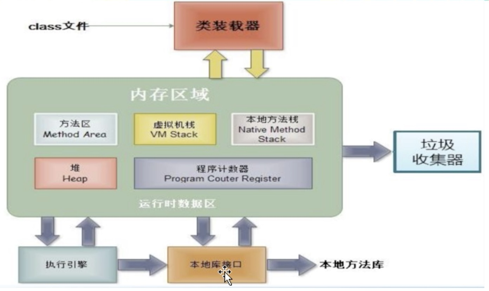
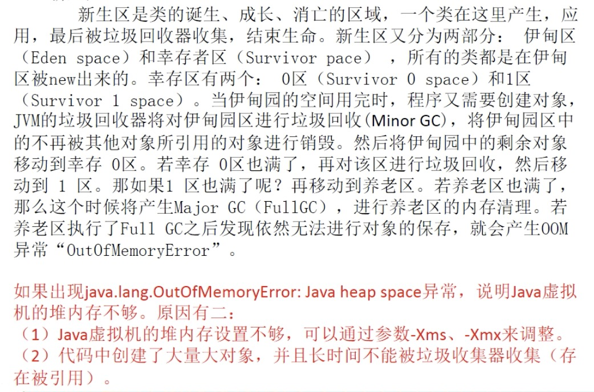
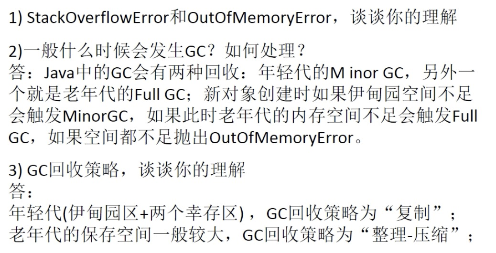

## JVM内存模型

> 如下图所示

主要包含4大块：ClassLoader类加载器、==Runtime Data Area 运行时数据区==、Execution Engine执行引擎、Native Interface本地接口。

- Class Loader类加载器

  负责加载class文件，class文件在文件开头有特殊的文件标识，并且ClassLoader只负责class文件的加载，至于它是否可以运行，则由Execution Engine决定

- Native Interface 本地接口

  本地接口的作用是为了兼容C和C++，通过Native接口来调用C/C++程序，实现间接操作计算机硬件

- Method Area方法区

  方法区被所有线程共享，所有字段和方法字节码，以及一些特殊方法如构造函数，接口代码也在此定义。简单说，所有定义的方法的信息都保存在该区域，此区属于共享区间。

  ==**静态变量+常量+类信息+运行时常量池存在方法区中**==

  ==**实例变量存在堆内存中**==

  注：**==方法区和堆内存空间都是线程共享的，所以JVM调优主要优化的就是堆(主要)和方法区(极少)==**

- PC Register程序计数器

  每个线程都有一个程序计数器，就是一个指针，指向方法区中的方法字节码(下一个将要执行的指令代码)，由执行引擎读取下一条指令，是一个非常小的内存空间，几乎可以忽略不计。

- Native  Method Stack 本地方法栈

  它的具体做法是：在Native  Method Stack中登记native方法，在Execution Engine执行时加载native libraries。

- Execution Engine执行引擎负责解释命令，提交操作系统执行

### JVM内存模型研究重点：堆和虚拟机栈

> 堆和虚拟机栈是对JVM研究的重点；==**栈管运行，堆管存储**==

#### 虚拟机栈

- 栈是什么

> 栈也叫栈内存，主管Java程序的运行，是在线程创建时创建，它的生命周期也是跟随着线程的生命期，线程结束栈内存就释放，**==对于栈来说不存在垃圾回收问题==**，只要线程一结束该栈内存就得到释放，栈内存是线程私有的。==基本类型的变量和对象的引用变量都是在栈内存中分配。==

- 栈存储什么

> 栈帧中主要保存3类数据：
>
> 1. 本地变量：输入参数以及输出参数以及方法内的变量；
> 2. 栈操作：记录出栈、入栈的操作；
> 3. 栈帧数据：包括类文件，方法等等。

#### 堆

##### 新生区

> 新生区又分为三个区：伊甸区、幸存0区、幸存1区

> new一个对象的时候，对象存放在新生代的伊甸区

##### 养老区

> 养老区用于保存从新生区筛选出来的Java对象，一般池对象都在这个区域活跃。

==**注：OOM(OutOfMemoryError)只会发生在养老区**==

##### 永久区

> 永久区是一个常驻内存区域，用于存放JDK自身所携带的Class，Interface的元数据，也就是说它存储的是运行环境必须的类信息，被装载进此区域的数据是不会被垃圾回收器回收掉的，关闭JVM才会释放此区域所占用的内存

> JDK1.6及之前：有永久代，常量池1.6在方法区
>
> JDK1.7:有永久代，但已经逐步“去永久代”，常量池1.7在堆
>
> JDK1.8及之后：无永久代，常量池1.8在元空间

#### GC面试题

- StackOverlfowError和OutOfMemoryError
  - StackOverflowError发生在栈内存中，当栈内存溢出，GC无法回收时抛出。
  - OutOfMemoryError发生在堆内存中，当堆内存中GC无法完全清除堆内存空间占用时抛出。