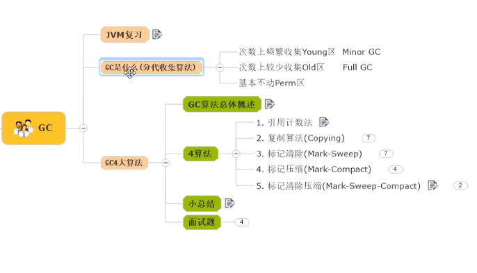
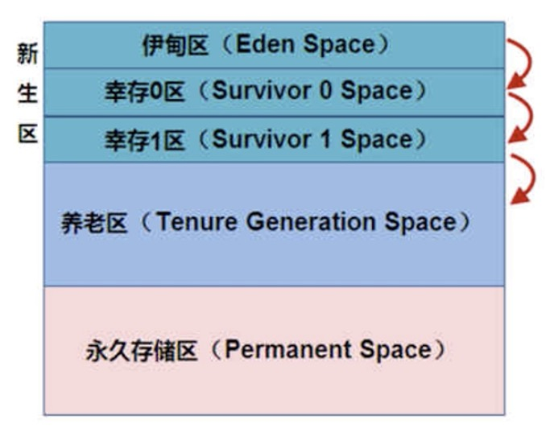
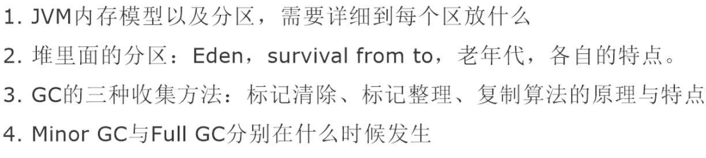

## JVM垃圾回收机制



### JVM调优

#### 参数

|        -Xms         | 设置初始值分配大小，默认为               |
| :-----------------: | ---------------------------------------- |
|        -Xms         | 设置初始分配大小，默认为物理内存的"1/64" |
|        -Xmx         | 最大分配内存，默认为物理内存的"1/4"      |
| -XX:+PrintGCDetails | 输出详细的GC处理日志                     |

具体使用方法：

```java
-Xms1024m -Xmx1024m -XX:+PrintGCDetails
```

#### GC是什么

- 频繁收集Young区
- 较少收集Old区
- 基本不动Perm区

#### GC三大算法



##### 复制算法

> MinorGC(普通GC)，年轻代中使用的是MinorGC，这种GC算法采用的是复制算法。==**(复制之后要交换，谁(survivor)空谁是to)**==

> MinorGC会把Eden中的所有活的对象都移到Survivor区域中，如果Survivor区中放不下，那么剩下的活的对象就被移到Old generation中，==**也即一旦收集后，Eden区就变成空的了。**==

> 优势：复制算法不会产生内存碎片，完整度极高

> 劣势：浪费了10%的内存空间；如果对象存活率很高的，需要将所有对象都复制一遍，并将所有引用地址重置一遍，所以复制算法想要使用，==最起码对象的存活率要非常低才行==，而且最重要的是必须克服50%内存的浪费。

**==注：可以通过-XX:MaxTenuringThreshold来设置复制算法中的年龄阈值==**

##### 标记清除/标记整理算法：FullGC又叫MajorGC(全局GC)

> 老年代一般是由标记清除或者是标记清除与标记整理的混合实现

- 标记清除

  > 缺点：1.效率比较低(递归与全堆对象遍历)而且在GC的时候，需要停止应用程序，这会导致用户体验非常差劲
  >
  > 2.这种方式清理出来的空闲内存是不连续的，而为了应付这一点

- 标记整理

  > 缺点：标记并且整理，效率较低



