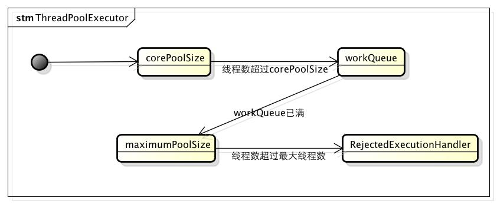

## 线程池

### 为什么使用线程池，优势

> 线程池做的工作主要是控制运行线程的数量，处理过程中将任务放入队列，然后在线程创建后启动这些任务，如果线程数量超过了最大数量，超出数量的线程排队等候，等其他线程执行完毕，再从队列中取出任务来执行。

主要特点：==**线程复用；控制最大并发数；管理线程**==

#### 架构说明


#### 编码实现

- Executors.newSingleThreadExecutor()：只有一个线程的线程池，因此所有提交的任务是顺序执行
- Executors.newCachedThreadPool()：线程池里有很多线程需要同时执行，老的可用线程将被新的任务触发重新执行，如果线程超过60秒内没执行，那么将被终止并从池中删除
- Executors.newFixedThreadPool()：拥有固定线程数的线程池，如果没有任务执行，那么线程会一直等待
- Executors.newScheduledThreadPool()：用来调度即将执行的任务的线程池
- Executors.newWorkStealingPool()： newWorkStealingPool适合使用在很耗时的操作，但是newWorkStealingPool不是ThreadPoolExecutor的扩展，它是新的线程池类ForkJoinPool的扩展，但是都是在统一的一个Executors类中实现，由于能够合理的使用CPU进行对任务操作（并行操作），所以适合使用在很耗时的任务中

#### ThreadPoolExecutor

ThreadPoolExecutor作为java.util.concurrent包对外提供基础实现，以内部线程池的形式对外提供管理任务执行，线程调度，线程池管理等等服务。

### 线程池的几个重要参数介绍？

| 参数                     | 作用                                                         |
| :----------------------- | :----------------------------------------------------------- |
| corePoolSize             | 核心线程池大小                                               |
| maximumPoolSize          | 最大线程池大小                                               |
| keepAliveTime            | 线程池中超过 corePoolSize 数目的空闲线程最大存活时间；可以allowCoreThreadTimeOut(true) 使得核心线程有效时间 |
| TimeUnit                 | keepAliveTime 时间单位                                       |
| workQueue                | 阻塞任务队列                                                 |
| threadFactory            | 新建线程工厂                                                 |
| RejectedExecutionHandler | 当提交任务数超过 maxmumPoolSize+workQueue 之和时，任务会交给RejectedExecutionHandler 来处理 |

说说线程池的底层工作原理？

**重点讲解：** 其中比较容易让人误解的是：corePoolSize，maximumPoolSize，workQueue之间关系。

1. 当线程池小于corePoolSize时，新提交任务将创建一个新线程执行任务，即使此时线程池中存在空闲线程。
2. 当线程池达到corePoolSize时，新提交任务将被放入 workQueue 中，等待线程池中任务调度执行。
3. 当workQueue已满，且 maximumPoolSize 大于 corePoolSize 时，新提交任务会创建新线程执行任务。
4. 当提交任务数超过 maximumPoolSize 时，新提交任务由 RejectedExecutionHandler 处理。
5. 当线程池中超过corePoolSize 线程，空闲时间达到 keepAliveTime 时，关闭空闲线程 。
6. 当设置allowCoreThreadTimeOut(true) 时，线程池中 corePoolSize 线程空闲时间达到 keepAliveTime 也将关闭。



### 线程池的拒绝策略你谈谈？

- 是什么
  - 等待队列已经满了，再也塞不下新的任务，同时线程池中的线程数达到了最大线程数，无法继续为新任务服务。
- 拒绝策略
  - AbortPolicy：处理程序遭到拒绝将抛出运行时 RejectedExecutionException
  - CallerRunsPolicy：线程调用运行该任务的 execute 本身。此策略提供简单的反馈控制机制，能够减缓新任务的提交速度。
  - DiscardPolicy：不能执行的任务将被删除
  - DiscardOldestPolicy：如果执行程序尚未关闭，则位于工作队列头部的任务将被删除，然后重试执行程序（如果再次失败，则重复此过程）

### 你在工作中单一的、固定数的和可变的三种创建线程池的方法，你用哪个多，超级大坑？

如果读者对Java中的阻塞队列有所了解的话，看到这里或许就能够明白原因了。

Java中的BlockingQueue主要有两种实现，分别是ArrayBlockingQueue 和 LinkedBlockingQueue。

ArrayBlockingQueue是一个用数组实现的有界阻塞队列，必须设置容量。z

LinkedBlockingQueue是一个用链表实现的有界阻塞队列，容量可以选择进行设置，不设置的话，将是一个无边界的阻塞队列，最大长度为Integer.MAX_VALUE。

这里的问题就出在：不设置的话，将是一个无边界的阻塞队列，最大长度为Integer.MAX_VALUE。也就是说，如果我们不设置LinkedBlockingQueue的容量的话，其默认容量将会是Integer.MAX_VALUE。

而newFixedThreadPool中创建LinkedBlockingQueue时，并未指定容量。此时，LinkedBlockingQueue就是一个无边界队列，对于一个无边界队列来说，是可以不断的向队列中加入任务的，这种情况下就有可能因为任务过多而导致内存溢出问题。

上面提到的问题主要体现在newFixedThreadPool和newSingleThreadExecutor两个工厂方法上，并不是说newCachedThreadPool和newScheduledThreadPool这两个方法就安全了，这两种方式创建的最大线程数可能是Integer.MAX_VALUE，而创建这么多线程，必然就有可能导致OOM。

### 你在工作中是如何使用线程池的，是否自定义过线程池使用？

自定义线程池

```java
public class ThreadPoolExecutorDemo {

    public static void main(String[] args) {
        Executor executor = new ThreadPoolExecutor(2, 3, 1L, TimeUnit.SECONDS,
                new LinkedBlockingQueue<>(5), 
                Executors.defaultThreadFactory(), 
                new ThreadPoolExecutor.DiscardPolicy());
    }
}
```

### 合理配置线程池你是如果考虑的？

- CPU 密集型
  - CPU 密集的意思是该任务需要大量的运算，而没有阻塞，CPU 一直全速运行。
  - CPU 密集型任务尽可能的少的线程数量，一般为 CPU 核数 + 1 个线程的线程池。
- IO 密集型
  - 由于 IO 密集型任务线程并不是一直在执行任务，可以多分配一点线程数，如 CPU * 2 。
  - 也可以使用公式：CPU 核数 / (1 - 阻塞系数)；其中阻塞系数在 0.8 ～ 0.9 之间。

## 死锁编码以及定位分析

- 产生死锁的原因

  - 死锁是指两个或两个以上的进程在执行过程中，因争夺资源而造成的一种相互等待的现象，如果无外力的干涉那它们都将无法推进下去，如果系统的资源充足，进程的资源请求都能够得到满足，死锁出现的可能性就很低，否则就会因争夺有限的资源而陷入死锁。

- 代码

  ```
  public class DeadLockDemo {
      public static void main(String[] args) {
          String lockA = "lockA";
          String lockB = "lockB";
  
          DeadLockDemo deadLockDemo = new DeadLockDemo();
          Executor executor = Executors.newFixedThreadPool(2);
          executor.execute(() -> deadLockDemo.method(lockA, lockB));
          executor.execute(() -> deadLockDemo.method(lockB, lockA));
  
      }
  
      public void method(String lock1, String lock2) {
          synchronized (lock1) {
              System.out.println(Thread.currentThread().getName() + "--获取到：" + lock1 + "; 尝试获取：" + lock2);
              try {
                  Thread.sleep(1000);
              } catch (InterruptedException e) {
                  e.printStackTrace();
              }
              synchronized (lock2) {
                  System.out.println("获取到两把锁!");
              }
          }
      }
  }
  ```

- 解决

  - jps -l 命令查定位进程号

    ```
    28519 org.jetbrains.jps.cmdline.Launcher
    32376 com.intellij.idea.Main
    28521 com.cuzz.thread.DeadLockDemo
    27836 org.jetbrains.kotlin.daemon.KotlinCompileDaemon
    28591 sun.tools.jps.Jps
    ```

  - jstack 28521 找到死锁查看

    ```
    2019-05-07 00:04:15
    Full thread dump Java HotSpot(TM) 64-Bit Server VM (25.191-b12 mixed mode):
    
    "Attach Listener" #13 daemon prio=9 os_prio=0 tid=0x00007f7acc001000 nid=0x702a waiting on condition [0x0000000000000000]
       java.lang.Thread.State: RUNNABLE
    // ...
    Found one Java-level deadlock:
    =============================
    "pool-1-thread-2":
      waiting to lock monitor 0x00007f7ad4006478 (object 0x00000000d71f60b0, a java.lang.String),
      which is held by "pool-1-thread-1"
    "pool-1-thread-1":
      waiting to lock monitor 0x00007f7ad4003be8 (object 0x00000000d71f60e8, a java.lang.String),
      which is held by "pool-1-thread-2"
    
    Java stack information for the threads listed above:
    ===================================================
    "pool-1-thread-2":
            at com.cuzz.thread.DeadLockDemo.method(DeadLockDemo.java:34)
            - waiting to lock <0x00000000d71f60b0> (a java.lang.String)
            - locked <0x00000000d71f60e8> (a java.lang.String)
            at com.cuzz.thread.DeadLockDemo.lambda$main$1(DeadLockDemo.java:21)
            at com.cuzz.thread.DeadLockDemo$$Lambda$2/2074407503.run(Unknown Source)
            at java.util.concurrent.ThreadPoolExecutor.runWorker(ThreadPoolExecutor.java:1149)
            at java.util.concurrent.ThreadPoolExecutor$Worker.run(ThreadPoolExecutor.java:624)
            at java.lang.Thread.run(Thread.java:748)
    "pool-1-thread-1":
            at com.cuzz.thread.DeadLockDemo.method(DeadLockDemo.java:34)
            - waiting to lock <0x00000000d71f60e8> (a java.lang.String)
            - locked <0x00000000d71f60b0> (a java.lang.String)
            at com.cuzz.thread.DeadLockDemo.lambda$main$0(DeadLockDemo.java:20)
            at com.cuzz.thread.DeadLockDemo$$Lambda$1/558638686.run(Unknown Source)
            at java.util.concurrent.ThreadPoolExecutor.runWorker(ThreadPoolExecutor.java:1149)
            at java.util.concurrent.ThreadPoolExecutor$Worker.run(ThreadPoolExecutor.java:624)
            at java.lang.Thread.run(Thread.java:748)
    
    Found 1 deadlock.
    ```

    最后发现一个死锁。