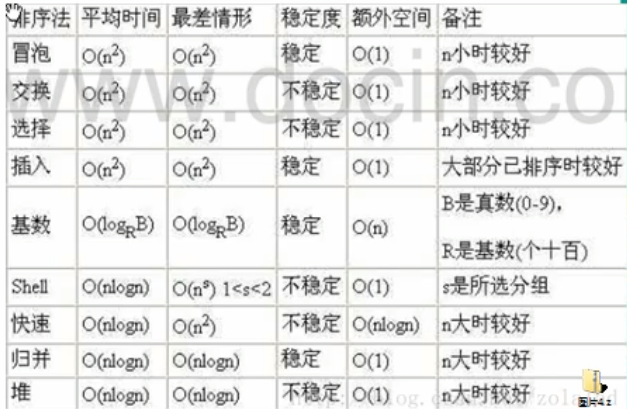

## 排序算法

#### 排序算法种类

> 插入排序

- 直接插入排序
- 希尔排序

> 选择排序

- 简单选择排序
- 堆排序

> 交换排序

- 冒泡排序
- 快速排序

> 归并排序

> 基数排序

#### 排序算法时间复杂度

#### 冒泡排序

> 通过对待排序序列从前向后（从下标较小元素开始），依次比较相邻元素的值，若发现逆序则交换，使值较大的元素逐渐从前向后移动，像气泡一样逐渐往上冒

给定数组[5,3,9,2,4]

- 第一趟排序后结果为：[3,5,2,4,9]
- 第二趟排序后结果为：[3,2,4,5,9]
- 第三趟排序后结果为：[2,3,4,5,9]

#### 选择排序

> 每次都选出数组最小值，与数组的第一个值进行交换

给定数组[5,3,9,2,4]

- 第一趟排序后结果为：[2,3,9,5,4]
- 第二趟排序后结果为：[2,3,9,5,4]
- 第三趟排序后结果为：[2,3,4,5,9]

#### 插入排序

> 将待排序数组看作一个有序数组和无须数组，依次将无序数组的第一个元素插入到有序数组中的适当位置

给定数组[5,3,9,2,4]

- 第一趟排序后结果为：[3,5,9,2,4]
- 第二趟排序后结果为：[3,5,9,2,4]
- 第三堂排序后结果为：[2,3,5,9,4]
- 第四趟排序后结果为：[2,3,4,5,9]

#### 希尔(shell)排序

> 先将待排序数组按步长gap分组，然后对每一组中的元素进行排序，循环此动作直到gap无限接近于0

给定数组[5,3,9,2,4]

- 第一趟排序后结果为：[5,2,9,3,4]
- 第二趟排序后结果为：[2,3,4,5,9]

#### 快速排序

> 在数组中先找到一个基准值以及位置，然后从数组的左边和右边分别开始查找，找到比基准值小的放左边，比基准值大的放右边，直到基准值左边所有元素都小于右边元素，然后对左边和右边元素进行递归

给定数组[5,3,9,2,4]，以中轴值为基准

- 第一轮交换的结果为：[5,3,4,2,9]

- 第二轮交换的结果为：[2,3,4,5,9]

